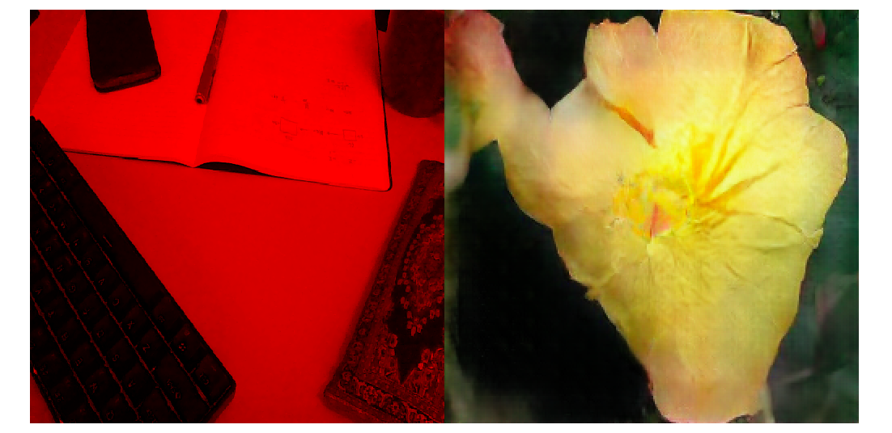

# Learning to Learn to See
### Thesis Project Final Outcome
### Josh Murr, MSc Creative Computing 19/20

> ### Text below is taken from the online demo which is [running here][demo].

## What is this?

This is a remake of Memo Akten's [Learning To See][lts] built specifically for the web. The model was designed and trained as explained in [the paper][ltspaper] based on the [Pix2Pix][pix2pix] model with some changes described below.

## Why?

_Learning To See_ has become a seminal piece in the still emerging world of machine-learning driven art. When exhibited in a gallery setting, visitors are presented with a camera facing straight down and a grey tabletop with an arbitrary selection of everyday items: a phone charger, a cloth, some keys. As the visitor plays with and moves these object around, the camera feed is streamed into a Convolutional Neural Network (CNN) which manipulates the incoming data. The model compresses and reshapes the image data down to an abstract representation of itself, and then reforms its original structure which is projected in front of the visitor as a new image.

As a piece it both demonstrates the capabilities and limitations of a machine learning model by using a simple interaction to allow users to manipulate the images produced by the model with instant feedback. This interaction is key to its success as it immediately shows how a model takes data as input (the image from the camera feed) and transforms that data into something new (the project image).

My own experience of the artwork is something which has stuck with me and it is the most successful artworks I have had the opportunity to interact with. It helped me to understand and engage with the abstract and academic world of machine learning, so the motivation behind creating this is to get that same opportunity to even more people on their own computers at home.

Machine learning on the internet is rich field of research as it poses many technical challenges. Typically a neural network requires great computational power to run a model of respectable size for two main reasons: a large model performs many thousands, sometimes millions of calculations on the input data to create an output; a pre-trained model itself is a collection of weights and biases which themselves take up memory on the host machine. So to create a real time interactive piece such as Learning to See the model needs to be small enough for most modern computers to be able to perform the calculations necessary and small enough to be quickly downloadable onto the users machine while holding enough information to create an interesting output.

## How does it work?

The Pix2Pix model is of a particular architecture which learns to find patterns in pairs of images: an input and a target. There are many use-cases for such a model in industry which can be read about in the [pix2pix paper][p2ppaper], but the core feature is that it will attempt to turn any input image into the type of output image it is able to create.

For example, take a model trained only on images of flowers; any image you give that model will be transformed into something similar to an image of a flower because that is all that model knows.

This particular implementation used Tensorflow to train the model and the Tensorflow Converter to convert the model weights into something which can be uploaded to a TensorflowJS model to run the model in the browser.

The Pix2Pix model is a Generative Adversarial Network which are known to be difficult to compress due to their unstable nature in training, so a key factor in producing a model small enough to be suitable for the web is simply to greatly reduce the number of trainable parameters in the model before training begins.

Secondly, and key to the success of the model running in the browser, is a custom made WebGL wrapper for the model which makes the model more suitable for video. There are a number of WebGL shader programs which handle the pre- and post-processing of the data being manipulated by the model, which is handled by TensorflowJS. TensorflowJS itself has good support for still image use-cases, but these are slow implementations of image manipulation algorithms which turned out to be unsuitable.

## Why is the input image red?

A single channel image when working with WebGL must be R, G or B. To get black and white you need all three which is 3 times as much data. So the webcam feed is sent as a red image which needs only one byte of data per pixel.

## Known Issues

This is a memory hog. If you run HTOP or something similar and run the demo you will see it eating up your memory. This is clearly a pretty big issue. As far as I can see from looking at memory profiles is that most of this is internal memory which is managed by TensorflowJS. The TensorflowJS API gives you access to `tf.disposeVariables()`, `tf.dispose()` and encourages the use of `tf.tidy()` to help with memory management ([see here for more information][tfmem]). It seems like I have done all that I can as a user of TensorflowJS to manage memory, but clearly it is not releasing memory as it runs. Closing the browser tab is enough to get the memory back to your machine but right now it remains an open issue. 

[lts]: http://www.memo.tv/works/learning-to-see/
[pix2pix]: https://affinelayer.com/pixsrv/
[p2ppaper]: https://arxiv.org/abs/1611.07004
[ltspaper]: https://arxiv.org/abs/2003.00902
[demo]: https://learning-to-learn-to-see.netlify.app/
[tfmem]: https://www.tensorflow.org/js/guide/tensors_operations#memory
